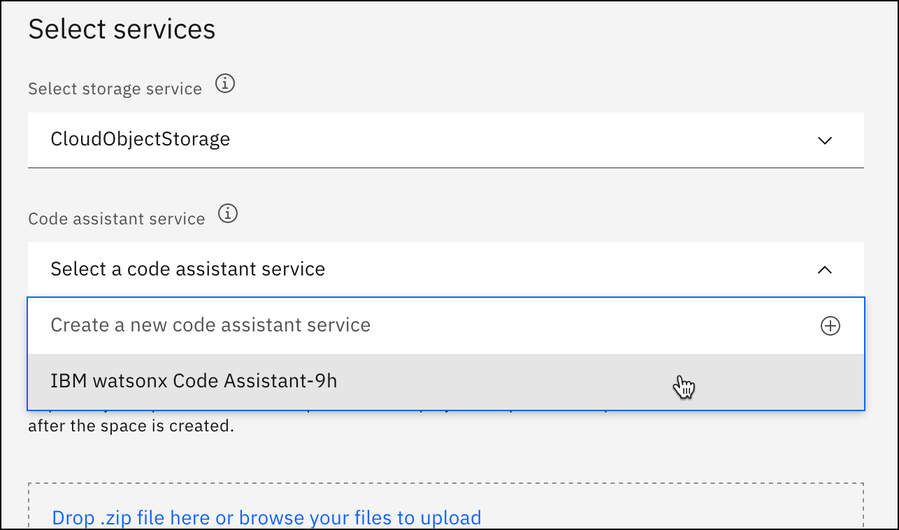

---

copyright:
   years: 2024
lastupdated: "2024-08-21"

keywords:

subcollection: watsonx-code-assistant
content-type: tutorial
completion-time: 20m

---

{{site.data.keyword.attribute-definition-list}}

# Setting up {{site.data.keyword.wca_short}} in {{site.data.keyword.cloud_notm}}
{: #cloud-setup-wcaej}
{: toc-content-type="tutorial"}
{: toc-completion-time="20m"}

As an {{site.data.keyword.cloud_notm}} administrator, you must connect the service with a deployment space. After you set up your environment, your developers can enable their IDE to interact with {{site.data.keyword.wca_short}}.
{: shortdesc}

## Before you begin
{: #cloud-setup-wcaej-prereqs}

- Make sure that you and your developers have [{{site.data.keyword.cloud_notm}} accounts](https://cloud.ibm.com/registration/){: external}.

- Provision an instance of {{site.data.keyword.wca_short}} through the [{{site.data.keyword.cloud_notm}} catalog](https://cloud.ibm.com/catalog){: external} page or by working with an IBM sales representative.

When you finish provisioning your instance, click **Setup** to open an onboarding checklist page to help you configure the instance. Or, you can select **Administration** and then **Setup** to access this onboarding checklist.

Items in the onboarding checklist correspond to each of the following steps. Click the action arrows on the checklist page that are associated with each item to complete the steps.

## Create a deployment space
{: #cloud-setup-wcaej-deploy-space}
{: step}

The deployment space is the serving environment for {{site.data.keyword.wca_short}}.

1. In your {{site.data.keyword.wca_short}} instance, click the **Navigation Menu** icon , then select **Deployments**.

1. Click **New deployment space**.

1. Enter `Code Assistant` as the name for your deployment space. Optionally, enter a description.

1. In **Code assistant service**, select your instance name.

   {: caption="Code assistant service"}

1. Click **Create**.

1. A status window appears. After the space is created, click **Close**.

## Create an access group
{: #cloud-setup-wcaej-access-group}
{: step}

1. Open the **Access groups** page in [{{site.data.keyword.iamshort}}](/iam/groups){: external}.

1. Click **Create**.

1. Enter a name for your access group, for example, `wca-instance-access`, then click **Create**.

1. In your new access group, click the **Access** tab.

1. Click **Assign access** to start a policy.

1. For **Service**, select **{{site.data.keyword.wca_full_notm}}**, then click **Next**.

1. For **Resources**, select **Specific resources**.

1. Select the resource group where you created your instance, then click **Next**.

1. For **Resource Group Access**, select **Viewer**, then click **Next**.

1. For **Roles and actions**, select **Viewer**.

1. **Conditions** aren't required, so click **Add**.

1. In the **Access summary** panel, click **Assign**.

## Invite developers to your {{site.data.keyword.cloud_notm}} account
{: #cloud-setup-wcaej-invite-users}
{: step}

Use {{site.data.keyword.iamshort}} to invite developers to your {{site.data.keyword.cloud_notm}} account.

1. Open the **Users** page in [{{site.data.keyword.iamshort}}](/iam/users){: external}.

1. Click **Invite users**.

1. Enter the email addresses of the users that you want to provide full access to. Separate email addresses with commas, spaces, or line breaks.

1. In **Select access groups**, select the access group you just created, then click **Add**.

1. Click **Invite**. Users that you invite receive an email to access the instance.

Ensure that each developer accepts the access invitation before you proceed to the next step of registering with {{site.data.keyword.wca_short}}.
{: note}

## Ask developers to log in to {{site.data.keyword.wca_short}}
{: #cloud-setup-wcaej-register-with-instance}
{: step}

After developers accept the access invitation, instruct them to log in to {{site.data.keyword.wca_short}} to register them.

1. Go to [https://dataplatform.cloud.ibm.com/registration/steptwo?context=wca&apps=all](https://dataplatform.cloud.ibm.com/registration/steptwo?context=wca&apps=all){: external}

1. Log in with your {{site.data.keyword.cloud_notm}} user name.

1. If there is an option to select an account, instruct the developers to choose the account from their access invitation.

1. When the {{site.data.keyword.wca_short}} welcome screen appears, they have registered. No other action is necessary and they can close the browser window.

Copy this link to send these instructions to your developers:

```html
https://cloud.ibm.com/docs/watsonx-code-assistant?topic=watsonx-code-assistant-cloud-setup-wcaej#cloud-setup-wcaej-register-with-instance
```
{: codeblock}

## Add developers to the deployment space
{: #cloud-setup-wcaej-add-users-deploy-space}
{: step}

After developers register with {{site.data.keyword.wca_short}}, add them to the deployment space.

1. On the **Manage** tab of your deployment space, click **Access control**.

1. Click **Add collaborators** and select **Add users** from the menu.

1. Press the space bar to see a list of all users in your account.

1. Select the users that you want to add.

1. Choose the **Editor** role for each user, then click **Add**.

## Ask developers to create an API key
{: #cloud-setup-wcaej-create-api-key}
{: step}

Each developer needs a personal API key to sign in to the extension for Microsoft Visual Studio Code or plugin for the Eclipse IDE. 

Use these instructions with your developers.

1. Sign in to [{{site.data.keyword.cloud_notm}} Keys](https://cloud.ibm.com/iam/apikeys){: external}

1. Click **Create**.

1. Enter `{{site.data.keyword.wca_full_notm}} API key` as the name for your API key. Optionally, enter a description.

1. Click **Create**.

1. Click **Download** or **Copy** and store the API key in a safe location.

   The key is only available for 296 seconds. Make sure to store it somewhere you can find it later.
   {: important} 

Copy this link to send these instructions to your developers:

```html
https://cloud.ibm.com/docs/watsonx-code-assistant?topic=watsonx-code-assistant-cloud-setup-wcaej#cloud-setup-wcaej-create-api-key
```
{: codeblock}

## Next step
{: #cloud-setup-wcaej-next_steps}

Developers can add the {{site.data.keyword.wca_short}} extension for Microsoft Visual Studio Code or plugin for the Eclipse IDE and start generating code recommendations. For more information, see the [private preview of {{site.data.keyword.wcaej_full_notm}}](https://early-access.ibm.com/software/support/trial/cst/welcomepage.wss?siteId=2044){: external}.
